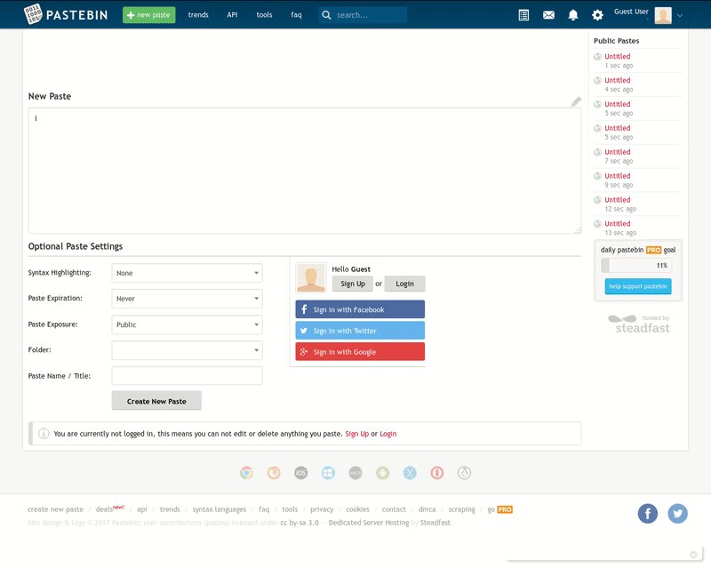

# cipher

Browser extension for encrypt/decrypt editable fields like emails, pastes, notes...

Some of them are:

- WhatsApp Web

- Google Keep

- Pastebin

- Inbox / Gmail

## Example

This is an example at [Pastebin](https://pastebin.com/):




## Install

You can install `cipher` from the [release](https://github.com/junquera/cipher/releases/tag/v1.0.2) (firefox and chrome) or from firefox [Add-ons](https://addons.mozilla.org/en-US/firefox/addon/cipher/) (just for firefox).

## Credits

- CryptoJS - [https://github.com/brix/crypto-js](https://github.com/brix/crypto-js)

## License

```
   Copyright 2018 Javier Junquera Sánchez <javier.junquera.sanchez@gmail.com>

   Licensed under the Apache License, Version 2.0 (the "License");
   you may not use this file except in compliance with the License.
   You may obtain a copy of the License at

       http://www.apache.org/licenses/LICENSE-2.0

   Unless required by applicable law or agreed to in writing, software
   distributed under the License is distributed on an "AS IS" BASIS,
   WITHOUT WARRANTIES OR CONDITIONS OF ANY KIND, either express or implied.
   See the License for the specific language governing permissions and
   limitations under the License.


```
